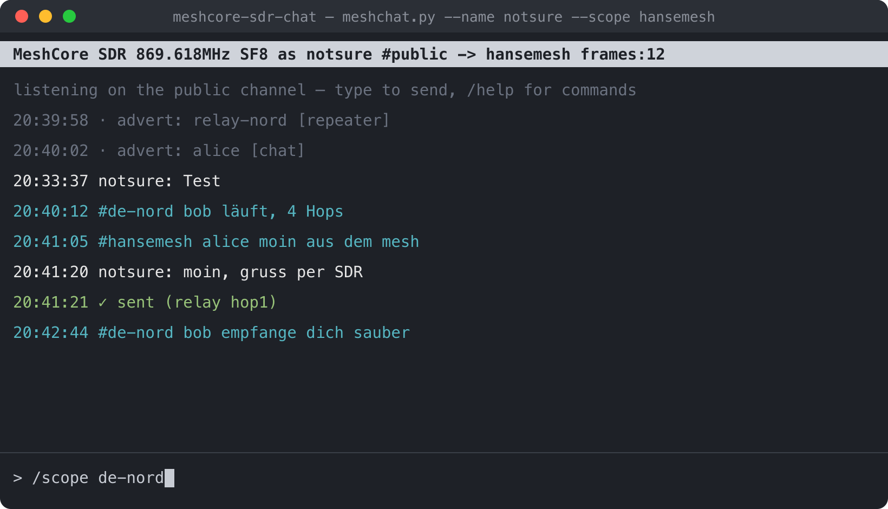
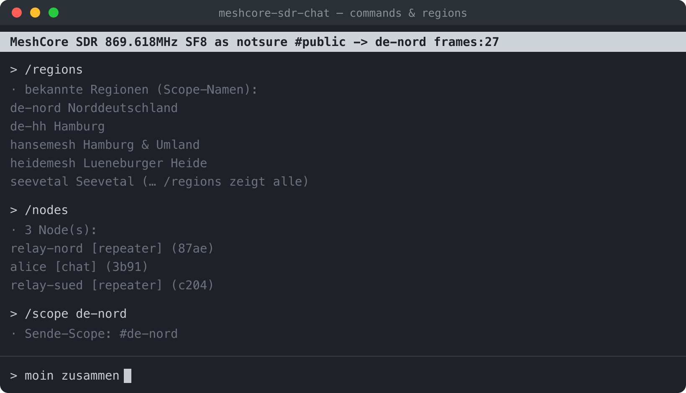

# meshcore-sdr-chat

Read **and** send on the [MeshCore](https://meshcore.co.uk/) public channel using a
software-defined radio — no LoRa transceiver chip required. The LoRa PHY is
handled entirely in software by [gr-lora_sdr](https://github.com/tapparelj/gr-lora_sdr),
and the MeshCore packet/crypto layer is implemented in `meshcore.py`.

A small terminal messenger: scrolling public-channel chat on top, an input line
at the bottom. Type and press Enter to transmit. It has been verified on the air
end to end — a transmitted message is relayed back by a real MeshCore repeater.



Incoming messages are tagged with the region they were forwarded through
(`#de-nord`, `#hansemesh`, …); your own sends are confirmed once you hear them
come back. **Click a received line** to reply in context — and *where* you click
picks what you adopt: click the **`#scope`** to adopt only the region, the
**`[channel]`** to adopt only the channel, or the **sender's name** (or the
message text) to adopt both and prefill the name for a reply (toggle mouse
capture with `/mouse`). IRC-style commands let you switch
channels, set the forwarding scope, and list the nodes you have heard:



## What it does

- **Receive**: demodulates LoRa off the air, parses MeshCore packets, and
  decrypts public-channel group-text messages (`PAYLOAD_TYPE_GRP_TXT`).
- **Send**: builds an encrypted public-channel message, LoRa-modulates it, and
  transmits it through the SDR.
- Shows node adverts dimly as a life-sign, deduplicates flood repeats, and
  confirms your own sends when you hear them come back (self-reception or a
  repeater relay).
- Each incoming line is tagged with an **approximate signal level** (dBFS, from
  a power tap — relative near/far, not calibrated RSSI). `/nodes` and `/discover`
  add signal and last-seen; `/map` plots node positions.
- **Chat history persists** and is scrollable (PageUp/PageDown), so a restart
  keeps your scrollback. The terminal **beeps** when your name is mentioned.
- An optional **watchdog** (`--watchdog SEC`, **off by default**) restarts the
  SDR if the decoded-frame counter stalls. It is off because the mesh is often
  quiet for long stretches — a stall is usually silence, not a fault — and the
  supervisor already respawns the worker on a real crash. Enable it (e.g.
  `--watchdog 1800`) only if your USB-attached USRP tends to wedge silently.
- **Session state persists** (`state.json`): joined and cracked channels, scope,
  monitor mode, heard nodes and `/discover` data are saved and reloaded, so a
  restart resumes where you were.
- **The SDR runs in its own process.** `gr-lora_sdr`'s `frame_sync` has a native
  SIGBUS bug that can crash the demod. The flowgraph therefore lives in a separate
  child process (`sdr_worker.py`); it talks to the UI over a stdin/stdout JSON
  pipe (decoded frames out, transmit commands in). If it crashes, a supervisor
  respawns it within a second and the UI, chat history and cracker never die —
  you just see `! SDR-Prozess beendet — Neustart` in the log. The worker's stderr
  is captured to `sdr_worker.log` so a device-open failure leaves a trail.

The public-channel key, packet format, and crypto (AES-128-ECB payload +
truncated HMAC-SHA256 MAC, channel hash = `SHA256(key)[0]`) are all derived from
the open-source MeshCore firmware — there are no secrets here, the "public"
channel is public by design.

## Hardware

Any **UHD / USRP** device that is transmit-capable and covers your region's
MeshCore band. Developed and verified on a **USRP B210** with a single antenna on
the **TX/RX** port (full-duplex: it transmits and receives on the same port; you
hear the repeater's relay after your own burst).

**SoapySDR** is also supported (`--sdr soapy`): an RTL-SDR is enough to *receive*
the public chat (`--sdr soapy --soapy-driver rtlsdr --rx-only`, forced automatically
for RX-only drivers), and a HackRF or PlutoSDR can transmit
(`--sdr soapy --soapy-driver hackrf`). A **PlutoSDR** is a good full-duplex choice —
especially a clone with a 0.5 ppm TCXO (~435 Hz offset at 869 MHz, negligible
against a 62.5 kHz LoRa channel). The Pluto can't sample below ~521 kSPS, so the
oversampling is bumped automatically to clear that floor. UHD remains the default
and is what the project is verified on.

### Sensitivity — read this if you want real range

A bare SDR is **much less sensitive than a dedicated LoRa chip** (SX1262 and
friends). The demodulator is not the problem — `gr-lora_sdr` dechirps close to
optimally — the front end is. A wideband SDR like the B210 has no low-noise
amplifier and no 868 MHz filter, so its noise figure is ~6–8 dB versus the
~2–3 dB of an SX1262. That is roughly **7–10 dB** worse sensitivity: in practice
you hear maybe half of what a chip radio hears. It is why a bare setup is great
for **playing around and experimenting**, but not for a serious node.

To close the gap — and even beat a chip radio — add, in this order of impact:

1. **A low-noise amplifier right at the antenna** (868 MHz, NF ~0.5–1 dB, ~20 dB
   gain). Put it *before* the coax: every dB of cable loss ahead of the LNA adds
   straight to the noise figure. With enough LNA gain the system noise figure
   drops to ~1–2 dB (Friis), i.e. better than the chip's internal LNA.
2. **A 868 MHz band-pass / SAW filter**, so strong neighbours (GSM, other ISM)
   don't drive the wideband front end into compression.
3. **Soft-decision decoding** for another ~1–2 dB (`soft_decoding` in
   `sdr_worker.py`; a little more CPU).

With an LNA + filter you are back around a chip radio's sensitivity, with all the
flexibility of an SDR (any band, any spreading factor, transmit without a chip).
Without them, treat it as a fun experiment rather than reliable coverage.

## Install

This is the involved part — `gr-lora_sdr` is not packaged and must be built.

1. **GNU Radio 3.10** and **UHD**
   - macOS: `brew install gnuradio uhd pybind11`
   - Debian/Ubuntu: `apt install gnuradio uhd-host libuhd-dev pybind11-dev cmake`
2. **Python dependency**: `pip install cryptography`
3. **Build gr-lora_sdr** against your GNU Radio:
   ```bash
   git clone https://github.com/tapparelj/gr-lora_sdr
   cd gr-lora_sdr && mkdir build && cd build
   cmake .. -DCMAKE_INSTALL_PREFIX=$(brew --prefix)      # Linux: /usr/local
   make -j$(nproc) && sudo make install       # macOS: no sudo if prefix is writable
   python3 -c "from gnuradio import lora_sdr; print('ok')"
   ```
   On macOS you may need `-Dpybind11_DIR="$(python3 -c 'import pybind11;print(pybind11.get_cmake_dir())')"`.
4. **Recommended:** apply [`patches/frame_sync-oob-crash.patch`](patches/) before
   building — it fixes an out-of-bounds read in `gr-lora_sdr`'s `frame_sync` that
   otherwise SIGBUS-crashes the demod at random (most often when the mesh is
   quiet). See [patches/README.md](patches/README.md).

## Usage

```bash
python3 meshchat.py --name yourhandle
```

Defaults target the **EU 868 MeshCore public channel**
(869.618 MHz, SF8, BW 62.5 kHz, CR 4/8, sync word 0x12). For other regions or a
custom channel, override the RF parameters:

```bash
python3 meshchat.py --name yourhandle --freq 910.525e6 --sf 10 --bw 250000 --cr 1
python3 meshchat.py --scope de-nord    # scope sends to a region (repeaters forward it)
python3 meshchat.py --rx-only          # listen only, no transmitter
python3 meshchat.py --plain            # line mode instead of the curses UI
python3 meshchat.py --sdr soapy --soapy-driver rtlsdr   # receive on a cheap RTL-SDR
python3 meshchat.py --log observed.jsonl                # passive observer log (see below)
```

### Monitor mode and key bruteforce

`--monitor` (or `/monitor`) decrypts and shows **every** catalog channel it can,
not just the ones you joined — a full readable view of the local mesh chat.

When a message arrives on a channel whose key we don't know, a background worker
cracks the channel **name**:

1. **Wordlist stage** — try each candidate as a hashtag key (`SHA256("#"+name)[:16]`).
   A built-in generator (`--crack`, ~3.6M names: German/English words, hackerspaces,
   postal codes, callsign and mesh patterns) or your own file (`--wordlist FILE`).
   The list is indexed by channel-hash byte, so only ~1/256 is tested per packet.
2. **Exhaustive stage** (`--brute-len N`) — for hashes the wordlist misses, brute
   every name up to N chars (`a-z0-9-`). A hit isn't trusted on the 2-byte MAC
   alone (that collides over billions of candidates) — the plaintext is decrypted
   and checked. Build the **native cracker** for real speed (OpenSSL + threads,
   uses the CPU's SHA instructions):

   ```bash
   ./build_cracker.sh        # needs OpenSSL (brew install openssl@3)
   ```

   It's used automatically if present, else a parallel-Python fallback runs.
   Rough native timings on a 16-core Mac: 4 chars <1 s, 5 ~seconds, 6 ~minutes,
   7 ~an hour, 8+ impractical (that's the ceiling of brute force, not the tool).

`--monitor` auto-enables cracking with the generator. A hit recovers the name and
the channel becomes readable live (`! CHANNEL GEKNACKT: #name`). Per-hash cooldown
avoids re-cracking uncrackable channels.

```bash
python3 meshchat.py --monitor                        # read all + crack (generator)
python3 meshchat.py --wordlist words.txt             # crack from a file
python3 meshchat.py --crack --brute-len 5 --monitor  # generator, then brute to 5 chars
```

### Passive observer log

`--log [file]` appends every heard advert and every public-channel message to a
JSONL file (one JSON object per line, default `meshcore-log.jsonl`), independent
of what the chat view shows. Useful as a long-running passive mesh monitor:

```json
{"t": "2026-08-01T20:40:12", "kind": "advert", "node": "a1b2c3", "name": "ExampleRelay", "type": "repeater", "lat": 53.0, "lon": 10.0, "hops": 1}
{"t": "2026-08-01T20:40:12", "kind": "msg", "channel": "public", "scope": "de-nord", "hops": 4, "text": "ExampleRelay: up, 4 hops"}
```

`python3 meshchat.py -h` for all options (`--rxgain`, `--txgain`, `--min-gap`,
`--device`, ...).

### In-chat commands

| command | action |
|---|---|
| `/help` | list commands |
| `/quit`, `/exit`, `Ctrl-D` | leave |
| `/name <name>` | change your display name on the fly |
| `/join #prefix` | browse the channel catalog; `/join #name` joins it (key derived from the name) |
| `/join <n> <psk>` | join a custom channel by base64 PSK |
| `/part <ch>` | leave a channel |
| `/channels` | list joined channels (`*` = active for sending) |
| `/scope #prefix` | browse regions; `/scope #name` sets the send region; `/scope off` = unscoped |
| `/regions [pre]` | list region names (optionally filtered) |
| `/discover` | active channels/regions from received traffic, with counts and last-seen |
| `/monitor` | decrypt and show ALL catalog channels, not just joined ones |
| `/filter <text>` | filter the chat view; PageUp/PageDown scroll, End jumps to live |
| `/map` | write `map.html` — a Leaflet map of nodes that advertised a position |
| `/nodes` | list nodes heard from adverts (name, type) |
| `/stats` | frames/messages/nodes counters and uptime |
| `/mute`, `/unmute` | stop / resume transmitting |
| `/ver` | toggle verbose: show send confirmations + adverts (off by default) |
| `/clear` | clear the chat view |

### Channels and scopes

Two independent concepts, IRC-style:

- **Channel** = encryption / who can read. `public` is built in. **Hashtag
  channels** (`#test`, `#allgaeu`, …) derive their key from the name the same way
  scopes do — `SHA256("#" + name)[:16]` — so `/join #name` needs no PSK (verified
  against live traffic). Truly private channels still take a base64 PSK
  (`/join myteam <psk>`). You can be in several at once — incoming messages are
  prefixed with `[channel]`. A bundled name catalog (`data/`) powers `/join #prefix`
  browsing and `/discover`, which reports which catalog channels/regions are
  actually on the air by trying their derived keys against received packets.
- **Scope** = which repeaters forward your message. MeshCore repeaters can be
  configured to only relay traffic *scoped* to a region they serve. Set it with
  `/scope de-nord` (or `--scope de-nord` at launch). The scope key is derived
  from the name as `SHA256("#" + name)[:16]`, and the packet's transport code is
  `HMAC-SHA256(scope_key, payload_type || payload)[:2]` — both verified against
  live traffic. `/scope off` sends a plain (unscoped) flood.

## Responsible use

- **This is ISM, not amateur radio.** The EU default (869.4–869.65 MHz) is a
  license-free SRD band with a **500 mW ERP limit and a 10% duty cycle**. A bare
  USRP without a PA stays far under the power limit; the built-in `--min-gap`
  keeps you well within the duty cycle. Know and respect your own region's rules.
- **Do not use a real callsign as your name** — this is not the amateur service,
  and impersonating a station is not okay. Pick a handle.
- It's a shared network used by other people. Don't flood it, don't spam, don't
  spoof identities. Be a good neighbour.

## Credits

- [gr-lora_sdr](https://github.com/tapparelj/gr-lora_sdr) — open LoRa PHY for GNU
  Radio (J. Tapparel et al., EPFL). This project would not exist without it.
- [MeshCore](https://github.com/ripplebiz/MeshCore) — the mesh firmware and
  protocol this speaks to.
- [GNU Radio](https://www.gnuradio.org/) and [UHD](https://github.com/EttusResearch/uhd).

## License

GPL-3.0-or-later. See [LICENSE](LICENSE). (Required: this project imports and
distributes alongside GNU Radio and gr-lora_sdr, which are GPLv3.)

*No warranty. You are responsible for operating your radio legally.*
